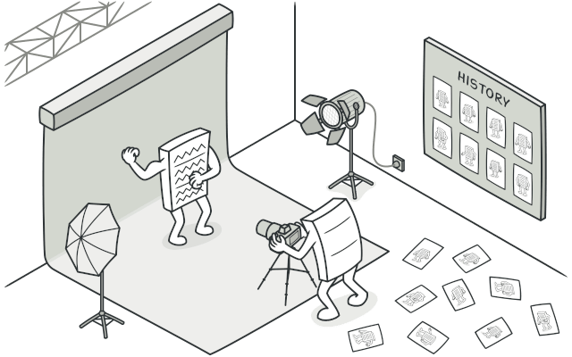

## Memento design pattern
Also known as: [Snapshot](https://refactoring.guru/design-patterns/memento) 
**[Memento](https://refactoring.guru/design-patterns/memento)** is a behavioral 
design pattern that lets you save and restore the previous state of an object 
without revealing the details of its implementation.

